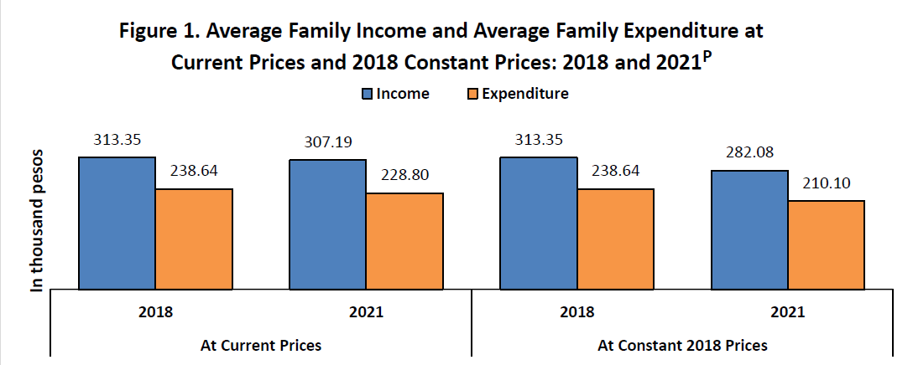
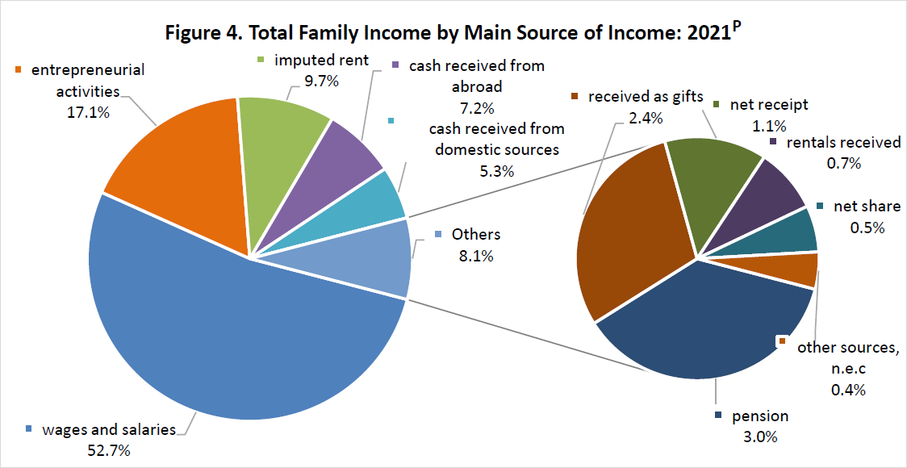
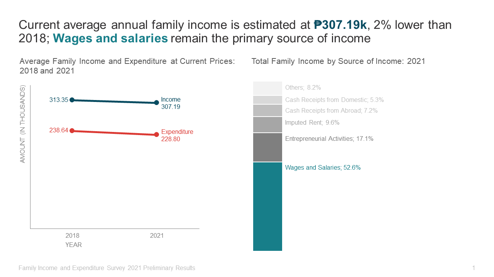
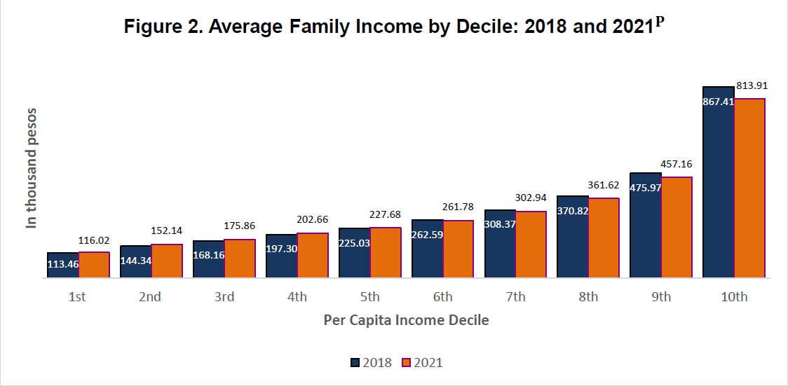
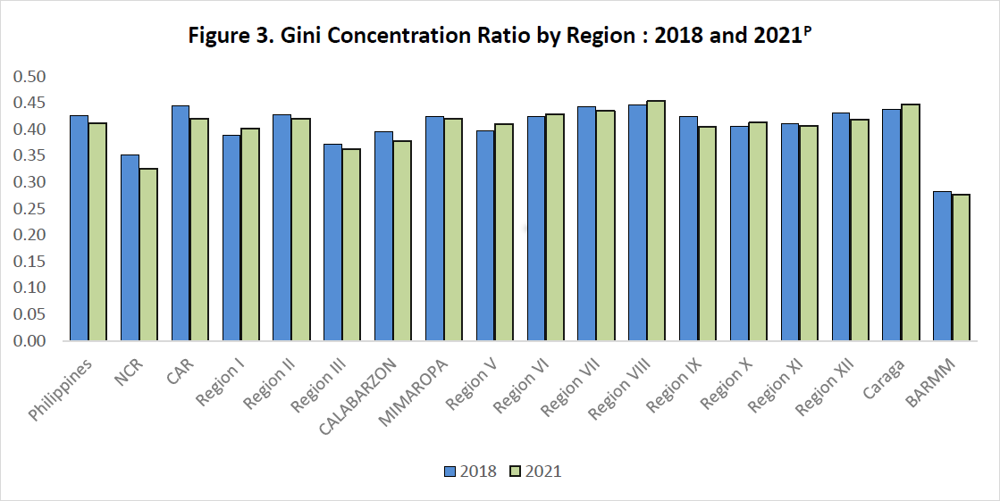
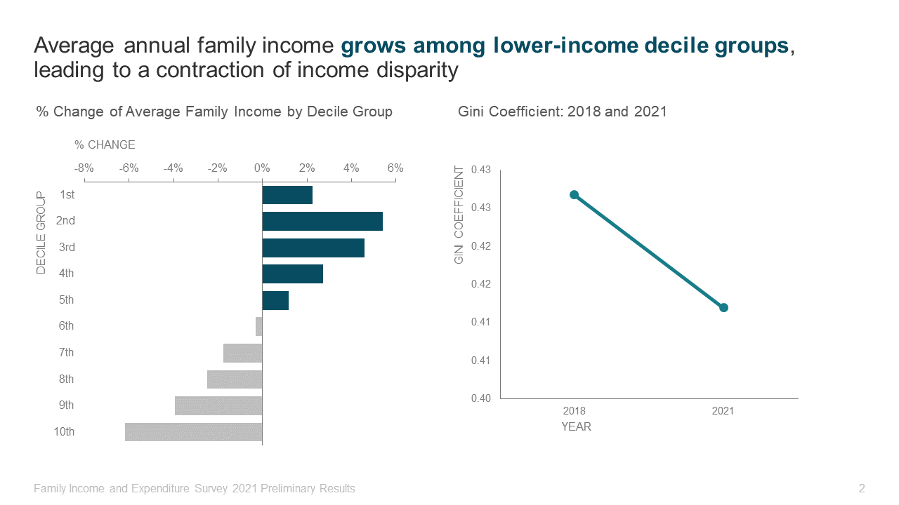

# PSA FIES Report Makeover

I redesign charts from the Philippine Statistics Authority's Family Income and Expenditure Survey 2021 Preliminary Findings report.

---

# Context

Ugly charts are everywhere. The horrible default colors and poor formatting prevent the charts from effectively communicating the author's insights. In this project, I redesigned the charts used by PSA by leveraging what I learned from Storytelling With Data.

# Result

